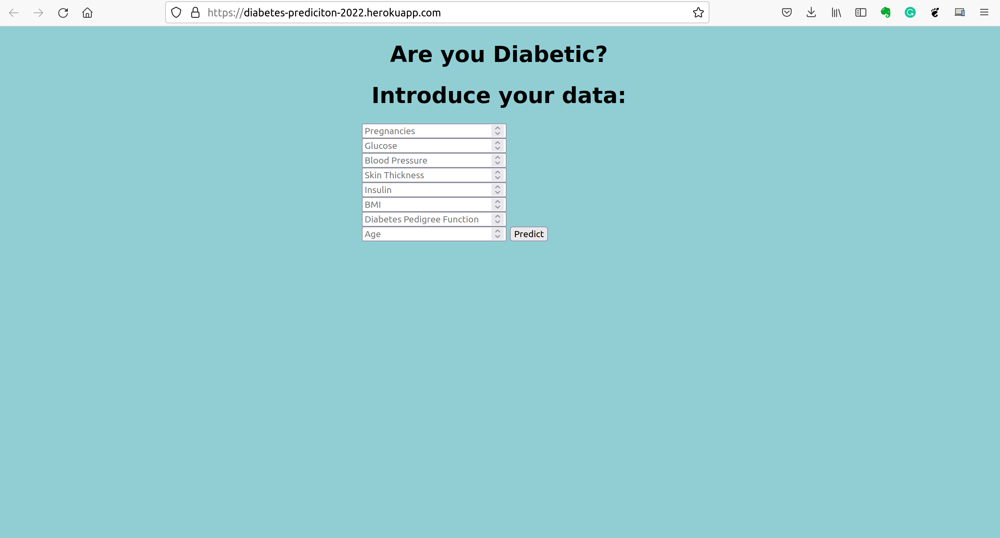

# Project: University Student Admission PredicitonProject 

## Table of Contents
* [General Information](#general-information)
* [Technologies Used](#technologies-used)
* [Outcomes and Impact](#outcomes)
* [Setup](#setup)
* [Deployment](#deployment)
* [Project Status](#project-status)
* [Room for Improvement](#room-for-improvement)
* [Contact](#contact)
<!-- * [License](#license) -->

## General Information
Developed a classification model for predicting diabetes, achieving an accuracy of 90% by utilizing various machine learning algorithms and employing advanced techniques such as Hyperparameter Tuning, Ensemble methods, and K-fold Cross-Validation.

[Dataset](https://www.kaggle.com/adityadeshpande23/admissionpredictioncsv)

The goal of this project is to predict whether a person is diabetic or not using the following parameters:
- General test score (GRE).
- Test of English as a Foreign Language score (TOEFL).
- University rating.
- Statement of Purpose (SOP).
- Letter of Recommendation (LOR). 
- Cumulative Grade Point Average (CGPA).

Key Features:
- Leveraged Logistic Regression, Decision Tree, Random Forest, XGBoost, K-Nearest Neighbor, Support Vector Machines, Naive Bayes, and Linear Discriminant Analysis algorithms.
- Applied advanced techniques for model enhancement, including Hyperparameter Tuning, Ensemble methods, and K-fold Cross-Validation.

Files configuration:
- classificationModel.ipynb: Step-by-step models implementation.
- classificationModel_Pipeline.ipynb: Models implementation using scikit-learn pipeline.

## Outcomes and Impact
Successfully built a classification model that predicted diabetes with 90% accuracy, aiding in early identification and management of diabetes risk factors.

The project aimed to provide a robust tool for early diabetes risk assessment, enabling proactive measures for disease prevention and management.

## Technologies Used
- Python 3.8.12
- Flask 2.0.2
- Werkzeug 2.0.2
- heroku 7.59.1

## Setup
requirements.txt:
- certifi==2021.10.8
- chardet==4.0.0
- click==8.0.3
- Flask==2.0.2
- Flask-Cors==3.0.10
- gunicorn==20.1.0
- heroku==0.1.4
- idna==2.10
- itsdangerous==2.0.1
- Jinja2==3.0.3
- joblib==1.1.0
- MarkupSafe==2.0.1
- numpy==1.22.1
- requests==2.25.1
- scikit-learn==1.0.2
- scipy==1.7.3
- six==1.16.0
- threadpoolctl==3.0.0
- urllib3==1.26.6
- Werkzeug==2.0.2

## Deployment
To install the requirements.txt file in your environment:
1. cd to the directory where requirements.txt is located.
2. activate your virtualenv.
3. run the command "pip install -r requirements.txt".

To deploy the files into Google Cloud:
1. Create an account on  https://heroku.com/.
2. Create a new project on the console (IAM & admin).
3. Once the project gets created, select Deploy option.
4. Follow the instructions depending on the deployment method used: Heroku Got, GitHub or using the Heroku CLI

## Project Status
Project is: _complete_ 

## Room for Improvement
Hyperparameter Tunning with GridSearchCV function and K-fold Cross Validation techniques are used to improve the performance.
But there are other techniques and algorithms that can be used.

## Contact
Created by [Xavier Nuel Gavaldà](xaviernuelgav@gmail.com) - feel free to contact me!

<!-- Optional -->
<!-- ## License -->
<!-- This project is open source and available under the [... License](). -->

<!-- You don't have to include all sections - just the one's relevant to your project -->
